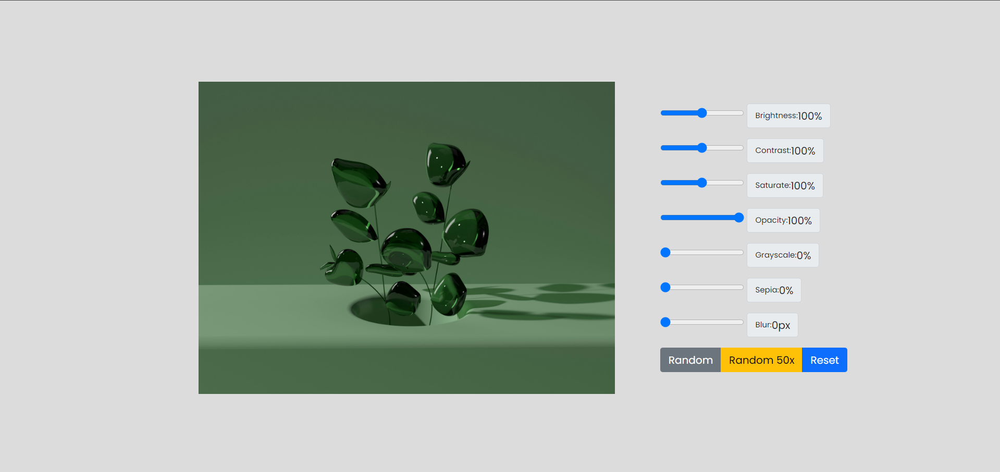

# Pixify : Image Filter Editor

## Overview

**Image Filter Editor** is a web application that allows users to apply various image filters such as brightness, contrast, saturation, grayscale, sepia, blur, and opacity to a sample image. It includes interactive sliders to control the intensity of each filter in real-time and a random filter feature to apply randomized filter settings.

## Features

- Adjust image filters including:
  - **Brightness**
  - **Contrast**
  - **Saturation**
  - **Opacity**
  - **Grayscale**
  - **Sepia**
  - **Blur**
- Reset filters to default values with one click.
- Apply random filters for fun.
- Loop random filters 50 times with the option to stop manually.

## Demo




## Usage

You can adjust the following filters by moving the sliders:

- **Brightness**: Ranges from 0% to 200%
- **Contrast**: Ranges from 0% to 200%
- **Saturation**: Ranges from 0% to 200%
- **Opacity**: Ranges from 0% to 100%
- **Grayscale**: Ranges from 0% to 100%
- **Sepia**: Ranges from 0% to 100%
- **Blur**: Ranges from 0px to 10px

You can also:

- Click **Random** to apply random filter settings.
- Click **Random 50x** to run a random filter effect 50 times in a loop.
- Click **Reset** to restore default filter settings.

## Getting Started

### Prerequisites

To run this project locally, you will need a web browser.

### Installation

1. Clone the repository:
   ```bash
   git clone https://github.com/yourusername/image-filter-editor.git
   ```

2. Navigate to the project folder:
   ```bash
   cd image-filter-editor
   ```

3. Open `index.html` in your preferred web browser.

### Project Files

- `index.html`: The main structure of the webpage.
- `style.css`: Contains the CSS styling for the page.
- `script.js`: Contains JavaScript logic for filter adjustments and event handling.

### Running the Application

Once the page is open in the browser, you'll see the sample image and sliders for adjusting filters. You can interact with the controls to apply effects in real-time.

## Future Enhancements

- Add an option for users to **upload their own images**.
- Provide a feature to **download the edited image**.
- Implement additional advanced filters.
- Add support for saving filter presets.

## Technologies Used

- **HTML5**: For webpage structure.
- **CSS3**: For styling the page and user interface.
- **JavaScript**: For handling image filters and user interactions.

## License

This project is licensed under the MIT License - see the [LICENSE](LICENSE) file for details.

